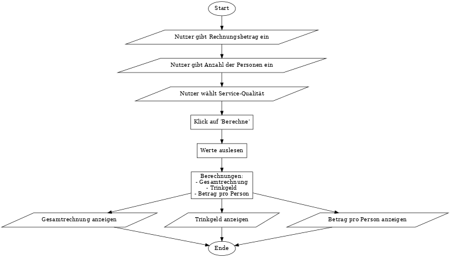

# Trinkgeldrechner

Dies ist ein einfacher Trinkgeldrechner, mit dem du die Gesamtrechnung, das Trinkgeld und den Betrag pro Person basierend auf einem Rechnungsbetrag, der Anzahl der Personen und der Servicequalität berechnen kannst.

## Funktionsweise

- Der Benutzer gibt den Rechnungsbetrag, die Anzahl der Personen und die Servicequalität an.
- Der Rechner berechnet dann:
  - Die Gesamtrechnung
  - Das Trinkgeld basierend auf der Servicequalität
  - Den Betrag, den jede Person zahlen muss

## Benutzung

1. Gib den Rechnungsbetrag in das Eingabefeld „Rechnungsbetrag“ ein.
2. Gib die Anzahl der Personen ein, die die Rechnung teilen sollen.
3. Wähle die Servicequalität aus (schlecht, mittel oder gut).
4. Klicke auf „Berechne“, um das Trinkgeld und den Betrag pro Person zu sehen.

## Beispiel

- **Rechnungsbetrag**: 100 €
- **Anzahl der Personen**: 4
- **Servicequalität**: Super Service (20%)

### Ergebnis:

- **Gesamtrechnung**: 100,00 €
- **Trinkgeld**: 20,00 €
- **Betrag pro Person**: 30,00 €

## Technologien

- HTML
- TypeScript
- Tailwind CSS

## Flowchart

Hier ist das Flowchart, das den Ablauf der Berechnungen visualisiert:

## Autor

Projekt von David Schwarz. [GitHub-Repo](https://github.com/davidschwarz153/Trinkgeldrechner)
